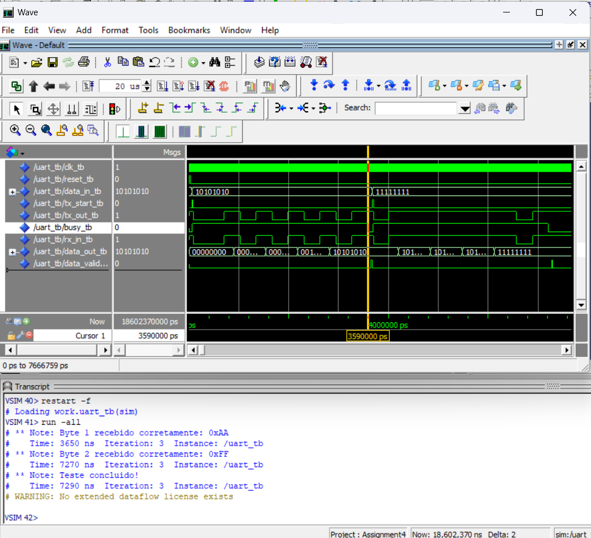
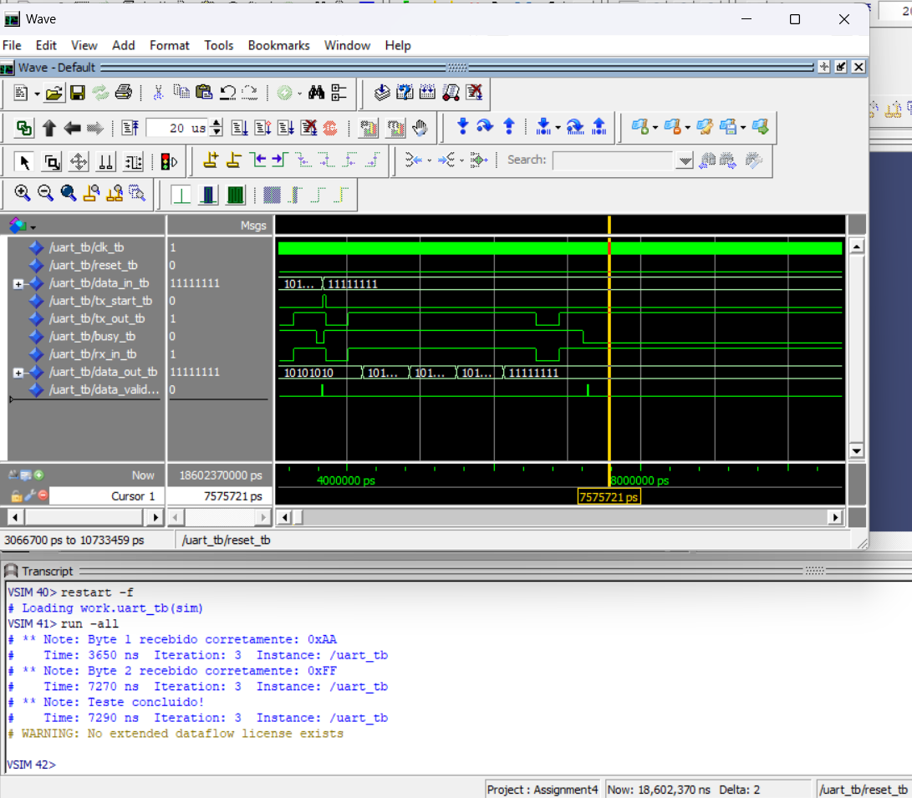

# Assignment 4 – UART em VHDL (8-N-1, Paridade Par)

**Aluno**: Marcelo Santos
**Email**: [a79433@ualg.pt](mailto:a79433@ualg.pt)
**UC**: Computação Reconfigurável
**Instituição**: Universidade do Algarve

---

## 📕 Objetivo

Implementar em VHDL um **UART** assíncrono com as seguintes características:

* **1 start bit**, **8 data bits (LSB first)**, **1 parity bit (even)**, **1 stop bit**.
* Dois processos separados: **Tx\_Process** e **Rx\_Process**.
* **Oversampling 8×** no receptor para amostragem no meio de cada bit.
* Validação via **loopback** (TX→RX) em testbench e simulação no ModelSim.

---

## 📁 Estrutura do Projeto

```
/
├── src/
│   ├── UART.vhd        ← Código do módulo UART
│   ├── UART\_tb.vhd     ← Testbench em loopback
└── README.md           ← Este documento
```

---

## ⚙️ Implementação

### UART.vhd

* **Transmissor (Tx\_Process)**

  * FSM: `IDLE → START → DATA → PARITY → STOP`
  * Envia 11 bits por frame com `BIT_TICKS = 16` ciclos/bit.
  * Calcula paridade par com XOR dos bits.

* **Receptor (Rx\_Process)**

  * FSM: `RX_IDLE → RX_START → RX_DATA → RX_PARITY → RX_STOP`
  * Amostragem sincronizada via oversampling 8× (amostra no meio de cada bit).
  * Problema anterior: o estado `RX_STOP` esperava ticks demais, perdendo frames contínuos.
  * **Correção aplicada**: reduzir `RX_STOP_COUNT` para `BIT_TICKS`, permitindo recepção contínua sem perda do segundo byte.

### tb\_uart.vhd

* Clock de 50 MHz (`20 ns` período).
* Reset inicial seguido do envio de dois bytes:

  * 1º byte = `0xAA` (`10101010₂`)
  * 2º byte = `0xFF` (`11111111₂`)
* Aguarda sinal `busy='0'` e depois `data_valid='1'` para checar `data_out`.
* Exibe no `Transcript` o sucesso ou erro da recepção.

---

## 🧪 Resultados da Simulação

Após a correção do tempo de parada na FSM de recepção, os dois bytes foram recebidos corretamente em sequência.

### 🖼️ Byte 1: `0xAA` Recebido com Sucesso

´

### 🖼️ Byte 2: `0xFF` Recebido com Sucesso



### 📜 Transcript da Simulação

```
# ** Note: Byte 1 recebido corretamente: 0xAA
# ** Note: Byte 2 recebido corretamente: 0xFF
# ** Note: Teste concluído!
```

---

**[Repositório GitHub](https://github.com/marcelo-m7/UART-em-VHDL---8-N-1--Paridade-Par)**
