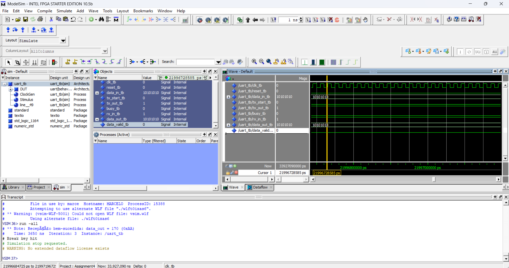

# Assignment 4 – UART em VHDL (8-N-1, Paridade Par)

**Aluno**: Marcelo Santos  
**Email**: a79433@ualg.pt  
**UC**: Computação Reconfigurável  
**Instituição**: Universidade do Algarve  

---

## 📕 Objetivo

Implementar em VHDL um **UART** assíncrono com as seguintes características:

- **1 start bit**, **8 data bits (LSB first)**, **1 parity bit (even)**, **1 stop bit**.  
- Dois processos separados: **Tx_Process** e **Rx_Process**.  
- **Oversampling 8×** no receptor para amostragem no meio de cada bit.  
- Validação via **loopback** (TX→RX) em testbench e simulação no ModelSim.

---

## 📁 Estrutura do Repositório

```
/
├── src/
│   ├── UART.vhd        ← Código do módulo UART
│   ├── UART\_tb.vhd     ← Testbench em loopback
│   └── image.png       ← Captura de tela da simulação no ModelSim
└── README.md           ← Este documento
````

---

## ⚙️ Implementação

### UART.vhd

- **Transmissor (Tx_Process)**  
  - FSM com estados **IDLE → START → DATA → PARITY → STOP**.  
  - Usa `BIT_TICKS = 16` ciclos de `clk` por bit para temporização.  
  - Calcula paridade par via XOR dos 8 bits antes de enviar.

- **Receptor (Rx_Process)**  
  - Detecta `rx_in = '0'` (start), depois **espera meio período** (8 ticks) para alinhamento 8×.  
  - Em seguida amostra cada bit no meio de seu período (16 ticks por bit).  
  - Reconstrói o byte paralelo (`data_out`) e sinaliza `data_valid` por um ciclo.  

### UART_tb.vhd

- Instancia o UART e faz **loopback**: `rx_in <= tx_out`.  
- Gera clock de **50 MHz** (`20 ns` período) e aplica reset inicial.  
- Envia o byte **0xAA** (`10101010₂`), aguarda `busy='0'` e depois `data_valid='1'`.  
- Emite **report** de sucesso (`data_out = 0xAA`) ou erro.

---

## 🧪 Resultados da Simulação

Após compilar e rodar:

```tcl
vcom -2002 src/UART.vhd
vcom -2002 src/UART_tb.vhd
vsim work.UART_tb
run -all
````

Obtivemos no Transcript a confirmação:

```
# ** Note: Recepção bem-sucedida: data_out = 170 (0xAA)
```

E, na visão **Wave** do ModelSim, observamos:

* **`tx_out`** transmitindo os 11 bits do frame (start→dados→parity→stop).
* **`busy`** alto durante toda a transmissão.
* **`data_valid`** pulso alto no ciclo de recepção final.
* **`data_out`** corretamente igual a `10101010₂`.



---

**[Repositório GitHub](https://github.com/marcelo-m7/UART-em-VHDL---8-N-1--Paridade-Par)**
